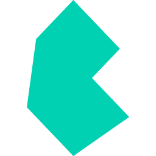

# turbo-themes

Universal, accessible theme packs and a drop-in theme selector.

[](https://bun.sh/)
[](https://nodejs.org/)
[](https://codecov.io/gh/lgtm-hq/turbo-themes)
[](LICENSE)
[](https://github.com/lgtm-hq/turbo-themes/actions/workflows/quality-ci-main.yml?query=branch%3Amain)
[](https://github.com/lgtm-hq/turbo-themes/actions/workflows/quality-ci-main.yml?query=branch%3Amain)
[](https://github.com/lgtm-hq/turbo-themes/actions/workflows/reporting-lighthouse-ci.yml?query=branch%3Amain)

[](https://github.com/lgtm-hq/turbo-themes/actions/workflows/security-codeql.yml?query=branch%3Amain)
[](https://www.bestpractices.dev/projects/11471)
[](SECURITY.md)
[](https://github.com/lgtm-hq/turbo-themes/actions/workflows/security-sbom.yml)

[](https://www.npmjs.com/package/@lgtm-hq/turbo-themes)
[](https://pypi.org/project/turbo-themes/)
[](https://rubygems.org/gems/turbo-themes)

[](https://bulma.io/)
[](https://catppuccin.com/)
[](https://draculatheme.com/)
[](https://primer.style/)

## Included Theme Packs

Built on [Bulma](https://bulma.io/) CSS framework with color palettes from these amazing
projects:

| Theme                                                                                                           | Variants                                                  | Source                                                                        |
| --------------------------------------------------------------------------------------------------------------- | --------------------------------------------------------- | ----------------------------------------------------------------------------- |
|  **Catppuccin** | Mocha, Macchiato, Frappé, Latte                           | [catppuccin.com](https://catppuccin.com/)                                     |
|  **Dracula**                    | Dark                                                      | [draculatheme.com](https://draculatheme.com/)                                 |
|  **GitHub**                  | Light, Dark                                               | [primer.style](https://primer.style/)                                         |
|  **Bulma**                          | Light, Dark                                               | [bulma.io](https://bulma.io/)                                                 |
|  **Nord**                                  | Nord                                                      | [nordtheme.com](https://www.nordtheme.com/)                                   |
|  **Solarized**              | Dark, Light                                               | [ethanschoonover.com/solarized](https://ethanschoonover.com/solarized/)       |
|  **Rosé Pine**                   | Rosé Pine, Moon, Dawn                                     | [rosepinetheme.com](https://rosepinetheme.com/)                               |
|  **Gruvbox**                    | Dark Hard, Dark, Dark Soft, Light Hard, Light, Light Soft | [github.com/morhetz/gruvbox](https://github.com/morhetz/gruvbox)              |
|  **Tokyo Night**             | Night, Storm, Light                                       | [tokyo-night-vscode-theme](https://github.com/enkia/tokyo-night-vscode-theme) |

## Features

- **24 curated themes** from Catppuccin, Gruvbox, Dracula, GitHub, Solarized, Tokyo
  Night, Nord, Rosé Pine, and Bulma
- **Multi-platform**: npm, PyPI, RubyGems, Swift Package Manager
- **Design tokens**: Platform-agnostic JSON tokens for any framework
- **Accessible**: WCAG-compliant with keyboard and screen reader support
- **Framework-agnostic**: Works with React, Vue, Svelte, vanilla JS, or native apps
- **Type-safe**: Full TypeScript, Python type hints, and Swift types
- **Tested**: Unit tests, E2E tests, Lighthouse CI, and visual regression

## Installation

| Platform                  | Package Manager | Install Command                                   |
| ------------------------- | --------------- | ------------------------------------------------- |
| **JavaScript/TypeScript** | npm / bun       | `npm install @lgtm-hq/turbo-themes`               |
| **Python**                | uv / pip        | `uv pip install turbo-themes`                     |
| **Ruby**                  | bundler         | `gem "turbo-themes", "~> 0.12"`                   |
| **Swift**                 | SPM             | Add `https://github.com/lgtm-hq/turbo-themes.git` |

### JavaScript/TypeScript

```bash
# Using Bun (recommended)
bun add @lgtm-hq/turbo-themes

# Using npm
npm install @lgtm-hq/turbo-themes
```

### Python

```bash
# Using uv (recommended)
uv pip install turbo-themes

# Or using pip
pip install turbo-themes
```

### Ruby (Jekyll)

```ruby
# Gemfile
gem "turbo-themes", "~> 0.12"
```

### Swift

Add via Xcode: `https://github.com/lgtm-hq/turbo-themes.git` (version `0.12.0`+)

## Quick Start

### Using Design Tokens (Recommended)

Access theme colors as platform-agnostic JSON tokens:

```ts
import tokens from '@lgtm-hq/turbo-themes/tokens.json';

const mocha = tokens.themes['catppuccin-mocha'];
console.log(mocha.tokens.brand.primary); // "#89b4fa"
```

### JavaScript/TypeScript

```ts
import { initTheme, wireFlavorSelector } from '@lgtm-hq/turbo-themes';

// Initialize theme system
initTheme(document, window);
wireFlavorSelector(document, window);
```

### Python

```python
from turbo_themes import ThemeManager, THEMES

manager = ThemeManager()
manager.set_theme("catppuccin-mocha")
css_vars = manager.apply_theme_to_css_variables()
```

### Swift

```swift
import TurboThemes

let mocha = ThemeRegistry.themes[.catppuccinMocha]
// Use theme colors in SwiftUI views
```

### Available Exports

| Import Path                         | Use Case                      |
| ----------------------------------- | ----------------------------- |
| `@lgtm-hq/turbo-themes/tokens.json` | Platform-agnostic JSON tokens |
| `@lgtm-hq/turbo-themes/tokens`      | TypeScript tokens with types  |
| `@lgtm-hq/turbo-themes/css/*`       | Pre-built CSS files           |

## Choosing Themes

Turbo Themes ships with 24 curated themes. Use the existing API exports to build a
catalog that stays in sync with the package automatically.

### Utility exports

```typescript
import {
  themeIds, // readonly string[] — all 24 IDs
  flavors, // ThemeFlavor[] — full metadata
  getThemesByVendor, // filter by vendor string
  getThemesByAppearance, // filter by 'dark' | 'light'
} from '@lgtm-hq/turbo-themes';
```

### Consumer curation patterns

```typescript
// a) All themes
const CATALOG = themeIds;

// b) Hardcoded minimal set (copy-paste friendly, no build required)
const CATALOG = [
  'catppuccin-mocha',
  'catppuccin-latte',
  'dracula',
  'github-dark',
  'github-light',
];

// c) Vendor opt-in — stays in sync automatically
const CATALOG = getThemesByVendor('catppuccin').map((f) => f.id);

// d) Appearance filter
const darkCatalog = getThemesByAppearance('dark').map((f) => f.id); // 15
const lightCatalog = getThemesByAppearance('light').map((f) => f.id); //  9
```

> **Planned in [#495](https://github.com/lgtm-hq/turbo-themes/issues/495):** A
> `themeSets` object (named pre-defined subsets) and a `createThemeCatalog()` factory
> (filter vendor + appearance in one call) will make these patterns even more concise.

### FOUC prevention with `generateBlockingScript()`

The `@lgtm-hq/turbo-theme-selector` package exports `generateBlockingScript()`, which
generates a self-contained inline script from your catalog. Inject it into `<head>` at
build time to apply the user's saved theme before first paint:

```typescript
import { generateBlockingScript } from '@lgtm-hq/turbo-theme-selector';

const script = generateBlockingScript({
  validThemes: ['catppuccin-mocha', 'catppuccin-latte', 'dracula'],
});
// Inline the returned string in a <script> tag in <head>
```

See the [theme switching guide](apps/site/src/content/docs/guides/theme-switching.md)
for a complete walkthrough.

## Examples

Complete, working examples demonstrating Turbo Themes integration with various
frameworks:

| Example                               | Framework    | Description                                | Try It                                                                                           |
| ------------------------------------- | ------------ | ------------------------------------------ | ------------------------------------------------------------------------------------------------ |
| [HTML Vanilla](examples/html-vanilla) | HTML/JS      | Zero-dependency vanilla JavaScript         | [StackBlitz](https://stackblitz.com/github/lgtm-hq/turbo-themes/tree/main/examples/html-vanilla) |
| [React](examples/react)               | React 18     | TypeScript with custom `useTheme` hook     | [StackBlitz](https://stackblitz.com/github/lgtm-hq/turbo-themes/tree/main/examples/react)        |
| [Vue](examples/vue)                   | Vue 3        | Composition API with `useTheme` composable | [StackBlitz](https://stackblitz.com/github/lgtm-hq/turbo-themes/tree/main/examples/vue)          |
| [Tailwind](examples/tailwind)         | Tailwind CSS | Preset integration with utility classes    | [StackBlitz](https://stackblitz.com/github/lgtm-hq/turbo-themes/tree/main/examples/tailwind)     |
| [Bootstrap](examples/bootstrap)       | Bootstrap 5  | SCSS integration with light/dark mode      | [StackBlitz](https://stackblitz.com/github/lgtm-hq/turbo-themes/tree/main/examples/bootstrap)    |
| [Jekyll](examples/jekyll)             | Jekyll       | Ruby gem integration                       | -                                                                                                |
| [SwiftUI](examples/swift-swiftui)     | SwiftUI      | iOS/macOS native app                       | -                                                                                                |

Each example includes theme switching, localStorage persistence, and FOUC prevention.
See the [examples directory](examples/) for full documentation.

## Testing

This project includes comprehensive testing:

- **Unit Tests**: Vitest with coverage reporting
- **E2E Tests**: Playwright with Page Object Model pattern
- **Accessibility Tests**: axe-core integration for WCAG compliance
- **Visual Regression**: Playwright screenshots and snapshots

Run tests:

```bash
# Using Bun (recommended)
bun run test          # Unit tests with coverage
bun run e2e           # All E2E tests
bun run e2e:smoke     # Smoke tests only
bun run e2e:visual    # Visual regression tests
bun run e2e:a11y      # Accessibility tests
bun run e2e:ui        # Playwright UI mode

# Using npm (also works)
npm test              # Unit tests with coverage
npm run e2e           # All E2E tests
```

For detailed E2E testing documentation, see `docs/E2E-TESTING.md`.

## Development Setup

### Prerequisites

- **Bun** 1.3+ (recommended) - [Install Bun](https://bun.sh/docs/installation)
- **Node.js** 22+ (alternative to Bun)
- **Python** 3.11+ with uv (for Python package development)
- **Ruby** 3.4+ with Bundler (optional, for gem builds)

### Quick Start

```bash
# Clone and install
git clone https://github.com/lgtm-hq/turbo-themes.git
cd turbo-themes
bun install
bundle install

# Build and serve
bun run build
bun run build:themes
bun run serve
```

### Why Bun?

This project uses [Bun](https://bun.sh/) as its primary JavaScript runtime for:

- **5-10x faster** package installation
- **10x faster** script startup time
- **~40% reduction** in CI build times
- Full npm compatibility (works with all existing packages)

## Documentation

- Code of Conduct: see `CODE_OF_CONDUCT.md`
- Contributing Guide: see `CONTRIBUTING.md`
- Security Policy: see `SECURITY.md`
- Release process: see `docs/RELEASE-TRAIN.md`
- E2E Testing: see `docs/E2E-TESTING.md`
- Workflows & Actions: see `.github/workflows/README.md` and `.github/actions/README.md`
- Scripts: see `scripts/README.md`

## Governance

See `GOVERNANCE.md` and `MAINTAINERS.md`.

## License

MIT © Turbo Coder
